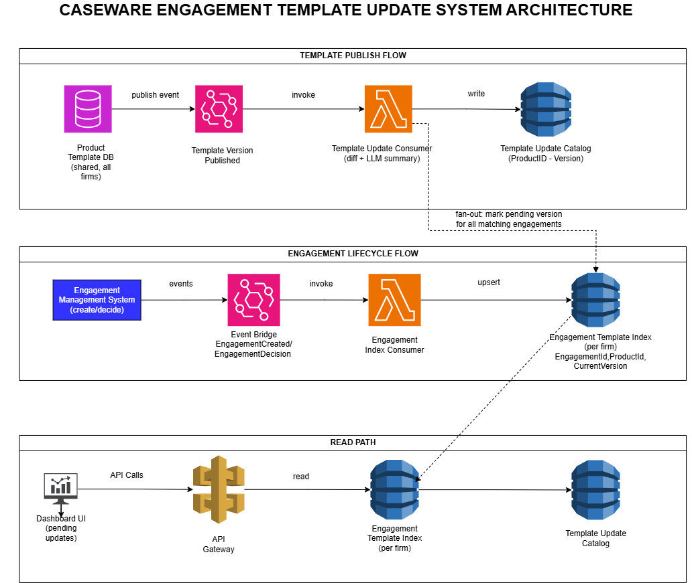

   

   # Design Document: Engagement Template Update Notification System

## 1. High-Level Architecture

To solve the challenge of tracking pending template updates across hundreds of engagements per firm without violating the hard performance constraint of ~1 minute per engagement load operation[cite: 1], the system adopts a **CQRS (Command Query Responsibility Segregation) and Event-Driven Architecture (EDA)**. 

### Why CQRS and Event-Driven Architecture?
By decoupling write operations (triggered via hooks when product templates are published or engagements are created/updated) from read operations (the dashboard UI), the system completely avoids the prohibitive cost of loading heavy engagement files (1 minute per file)[cite: 1]. Instead of querying monolithic engagement data on-demand, read paths query lightweight, pre-computed indices in milliseconds. This event-driven approach scales effortlessly to hundreds of engagements per firm without bottlenecks, reacting asynchronously to infrequent template updates (~once per week per product)[cite: 1] and immediate user actions using available system hooks.

### Multi-Tenant Data Isolation & Optimization Strategy
* **Shared Template Update Catalog:** All versions of product templates and their corresponding AI-generated human-readable diff summaries are stored in a **global, shared catalog** accessible across all customer firms. Because product templates are identical for all firms, computing diffs and generating LLM summaries once upon publication drastically saves compute resources and LLM API costs.
* **Partitioned Engagement Index (Per-Firm):** The engagement template index is **strictly partitioned by customer firm** (e.g., using tenant-isolated DynamoDB tables or partition keys). This guarantees strict data privacy, secure multi-tenant isolation, and high-performance querying without cross-tenant data leakage.

---

## 2. Implementation Plan

1. **Event Ingestion & Processing Pipeline:**
   - Capture publish events from the shared Product Template database and lifecycle events from the Engagement Management system via AWS EventBridge.
   - Implement asynchronous AWS Lambda workers (Java/Spring Boot) to compute JSON diffs and invoke LLM services for human-readable summaries.
2. **Indexing & Metadata Storage:**
   - Maintain the `Template Update Catalog` globally.
   - Maintain the `Engagement Template Index` partitioned per firm, storing only lightweight metadata (`Engagement ID`, `Product ID`, `Current Version`).
3. **Read Path & Dashboard Integration:**
   - Expose RESTful endpoints via Amazon API Gateway backed by a Spring Boot service.
   - Perform fast in-memory version comparison to display pending updates and AI summaries "at a glance"[cite: 1].

---

## 3. Testing Strategy

* **Unit Testing:** Validate JSON diff extraction logic and version comparison algorithms using JUnit 5 and Mockito.
* **Integration Testing:** Test event handlers and asynchronous lambda flows using local emulation (e.g., LocalStack for DynamoDB and EventBridge).
* **Contract Testing:** Ensure event schemas (`TemplateVersionPublished`, `EngagementCreated`) remain consistent between producers and consumers.

---

## 4. Evaluation & Observability

* **Metrics (CloudWatch):** Track event processing latency, LLM invocation success rates, API Gateway response times (target < 200ms for dashboard queries), and error rates on consumers.
* **Distributed Tracing (AWS X-Ray):** Trace events from the initial template publication or engagement creation down to the database upsert to debug any propagation delays.

---

## 5. Failure Modes & Tradeoffs

* **Failure Mode: LLM Service Timeout or Failure during Publication:**
  * *Mitigation:* Implement a Dead-Letter Queue (DLQ) in SQS combined with exponential backoff retries. If the LLM fails, the system can fall back to storing the raw technical JSON diff temporarily while flagging the summary for asynchronous regeneration.
* **Tradeoff: Eventual Consistency vs. Strong Consistency:**
  * *Tradeoff:* The dashboard relies on asynchronous events to update tracking metadata, introducing a brief delay (seconds) between a template publication and its appearance on the dashboard.
  * *Justification:* Given that template updates happen infrequently (~weekly)[cite: 1], eventual consistency is an acceptable tradeoff that trades instant synchronization for massive performance gains and elimination of write-lock contention.